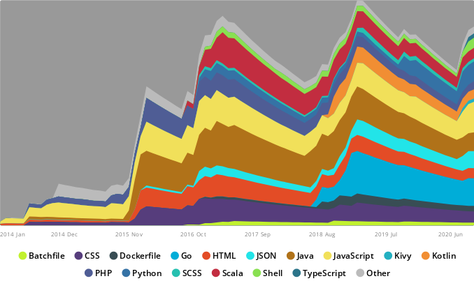

[](https://profile.codersrank.io/user/matfax)

### Hi there 👋

#### 🔭 I’m currently working on ...

1. GitHub Actions ecosystem
1. NodeJS HTML streaming
1. Docker tagging automation

#### 🌱 I’m currently learning ...

1. The limits of GitHub Actions

#### 👯 I’m looking to collaborate on ...

##### :octocat: Projects that focus on open source quality control
> My key agenda in the open source realm is the reduction of overhead and the enhancement of quality transparency by means of convention and automation. In specific, I focus on the challenge of the overall open source community when it comes to maintained forks of unmaintained projects and the maintenance of product-lined forks in general.

#### :rocket: I recommend these projects to open source enthusiasts ...

* Finding [active forks](https://github.com/techgaun/active-forks) of unmaintained projects

#### :clipboard: I've worked with these languages ...

[](https://profile.codersrank.io/user/matfax)

<!--START_SECTION:waka-->
**🐱 My Github Data** 

> 🏆 976 Contributions in the Year 2020
 > 
> 📦 92.2 kB Used in Github's Storage 
 > 
> 💼 Opted to Hire
 > 
> 📜 33 Public Repositories
 > 
> 🔑 6 Private Repositories 

📊 **This Week I Spent My Time On** 

```text
💬 Programming Languages: 
Other                    22 hrs 6 mins       ███████████████░░░░░░░░░░   60.97% 
TypeScript               7 hrs 34 mins       █████░░░░░░░░░░░░░░░░░░░░   20.89% 
YAML                     4 hrs 31 mins       ███░░░░░░░░░░░░░░░░░░░░░░   12.48% 
Bash                     1 hr 14 mins        ░░░░░░░░░░░░░░░░░░░░░░░░░   3.41% 
JSON                     18 mins             ░░░░░░░░░░░░░░░░░░░░░░░░░   0.84%

🔥 Editors: 
Chrome                   21 hrs 12 mins      ██████████████░░░░░░░░░░░   58.51% 
WebStorm                 13 hrs 44 mins      █████████░░░░░░░░░░░░░░░░   37.92% 
Powershell               50 mins             ░░░░░░░░░░░░░░░░░░░░░░░░░   2.33% 
IntelliJ                 26 mins             ░░░░░░░░░░░░░░░░░░░░░░░░░   1.24%

🐱‍💻 Projects: 
interactive-event-dispatc30 hrs 56 mins      █████████████████████░░░░   85.33% 
matfax                   4 hrs 17 mins       ███░░░░░░░░░░░░░░░░░░░░░░   11.86% 
pull-request-comment-even22 mins             ░░░░░░░░░░░░░░░░░░░░░░░░░   1.05% 
webhooks                 21 mins             ░░░░░░░░░░░░░░░░░░░░░░░░░   0.99% 
actions                  16 mins             ░░░░░░░░░░░░░░░░░░░░░░░░░   0.76%

```


<!--END_SECTION:waka-->

<!--
**matfax/matfax** is a ✨ _special_ ✨ repository because its `README.md` (this file) appears on your GitHub profile.

Here are some ideas to get you started:

- 🔭 I’m currently working on ...
- 🌱 I’m currently learning ...
- 👯 I’m looking to collaborate on ...
- 🤔 I’m looking for help with ...
- 💬 Ask me about ...
- 📫 How to reach me: ...
- 😄 Pronouns: ...
- ⚡ Fun fact: ...
-->
